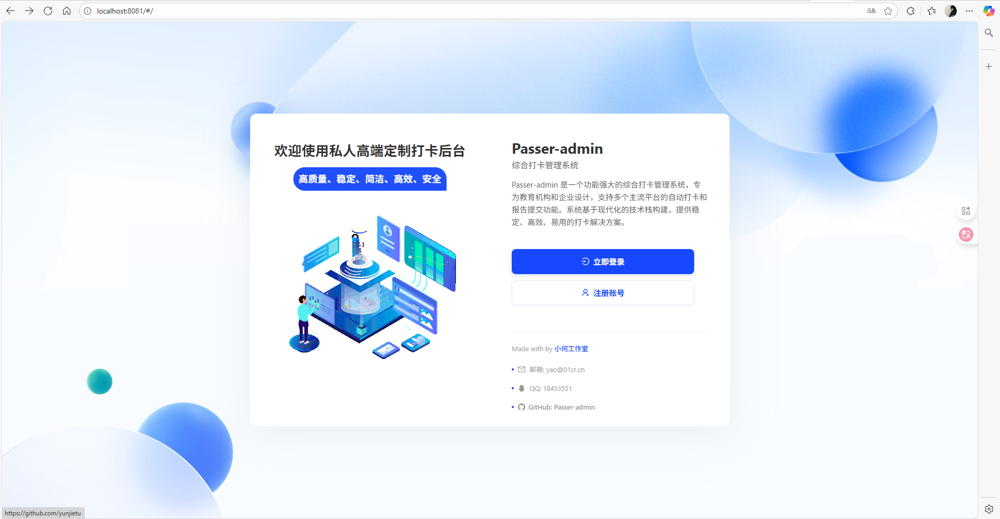
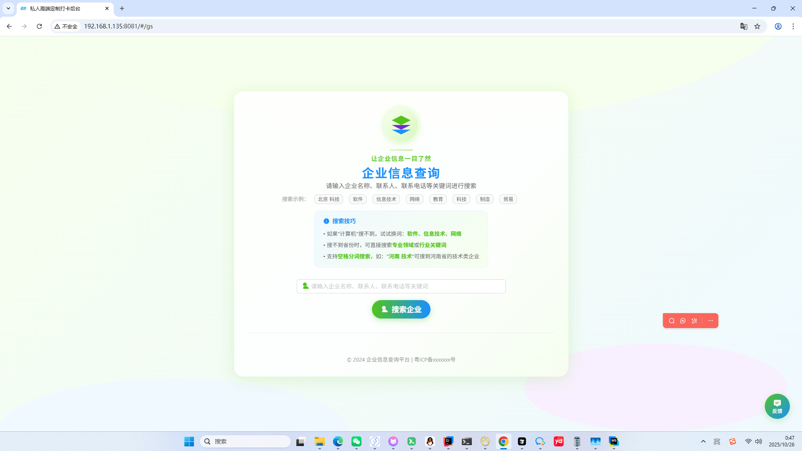
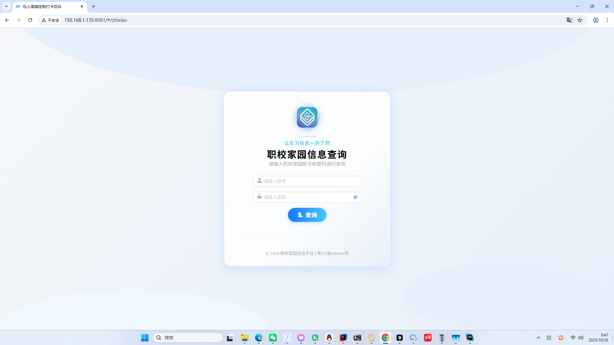
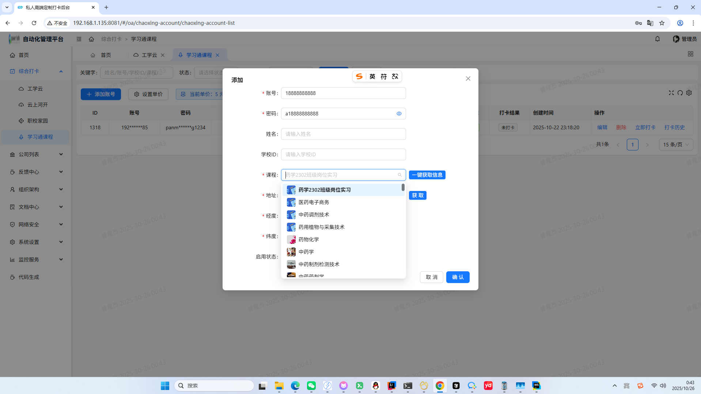
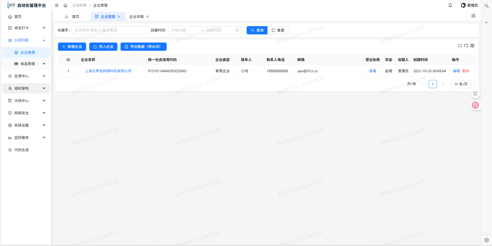
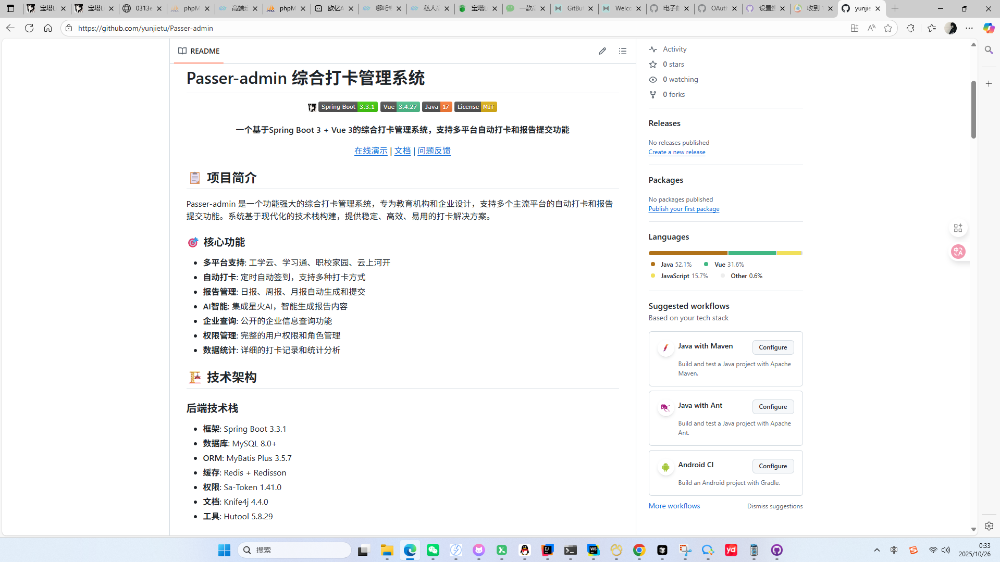
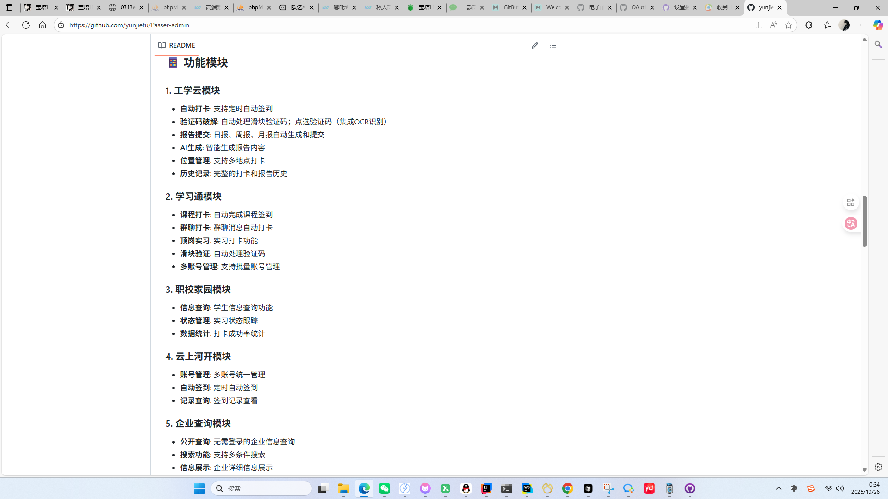
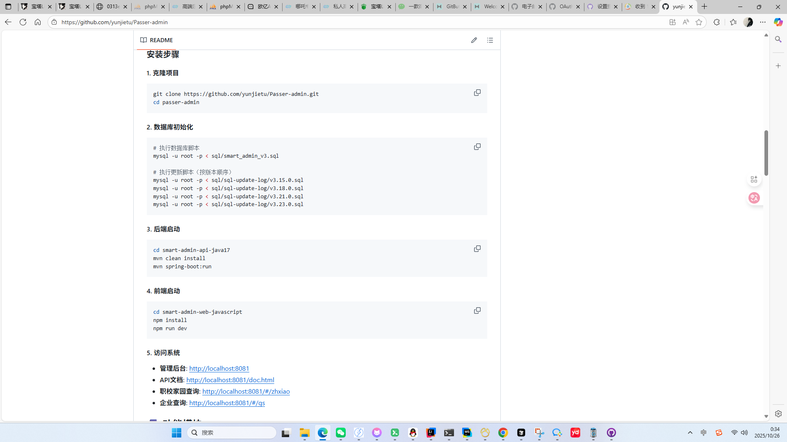
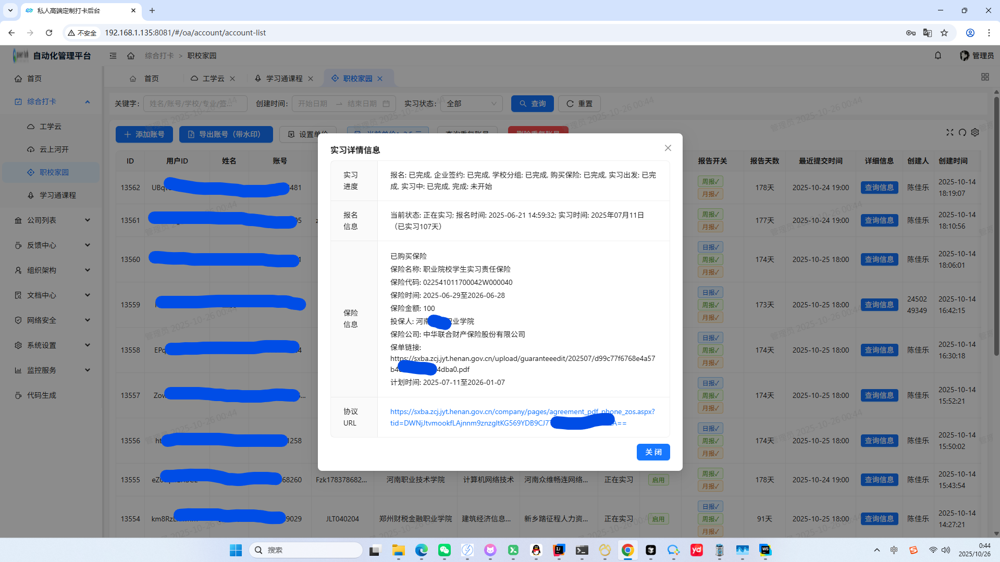
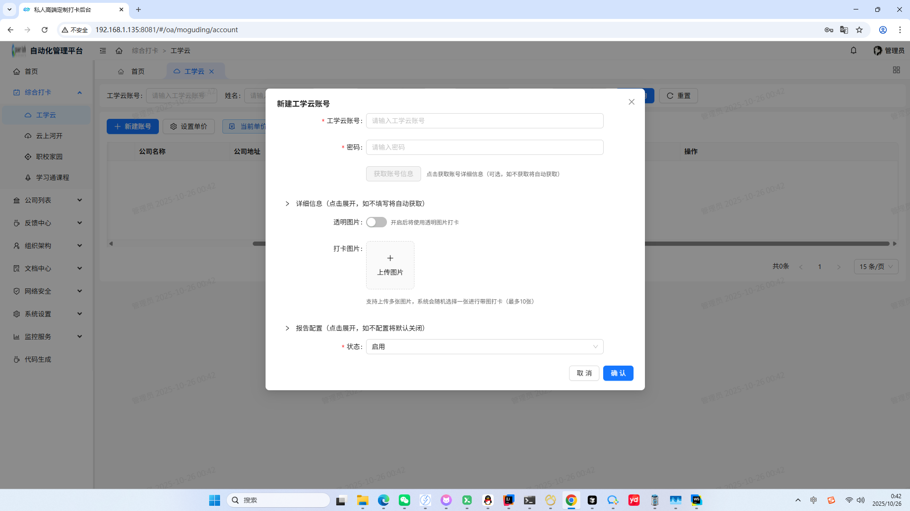

# Passer-admin 综合打卡管理系统

<div align="center">


**一个基于Spring Boot 3 + Vue 3的综合打卡管理系统，支持多平台自动打卡和报告提交功能**

[在线演示](http://i.daka1.com) | [文档](http://i.daka1.com) | [问题反馈](https://github.com/yunjietu/Passer-admin/issues)

</div>

## 📋 项目简介

Passer-admin 是一个功能强大的综合打卡管理系统，专为教育机构和企业设计，支持多个主流平台的自动打卡和报告提交功能。系统基于现代化的技术栈构建，提供稳定、高效、易用的打卡解决方案。

### 🎯 核心功能

- **多平台支持**: 工学云、学习通、职校家园、云上河开自动打卡
- **自动打卡**: 定时自动签到，支持多种打卡方式
- **报告管理**: 日报、周报、月报自动生成和提交
- **AI智能**: 集成星火AI，智能生成报告内容
- **企业查询**: 公开的企业信息查询功能
- **权限管理**: 完整的用户权限和角色管理
- **数据统计**: 详细的打卡记录和统计分析

## 💬 联系我们

- **官网**: https://i.daka1.com
- **邮箱**: yao@01cr.cn
- **QQ**: 18453551（优先）

- **程序纯源价格限时5xxx💰，联系付款后进入私人仓库源码持续同步更新**

## 📱 功能模块

### 1. 工学云模块
- **自动打卡**: 支持定时自动签到
- **验证码破解**: 自动处理滑块验证码；点选验证码（集成OCR识别）
- **报告提交**: 日报、周报、月报自动生成和提交
- **AI生成**: 智能生成报告内容
- **位置管理**: 支持多地点打卡
- **历史记录**: 完整的打卡和报告历史

### 2. 学习通模块
- **课程打卡**: 自动完成课程签到
- **群聊打卡**: 群聊消息自动打卡
- **顶岗实习**: 实习打卡功能
- **滑块验证**: 自动处理验证码
- **多账号管理**: 支持批量账号管理

### 3. 职校家园模块
- **信息查询**: 学生信息查询功能
- **状态管理**: 实习状态跟踪
- **数据统计**: 打卡成功率统计

### 4. 云上河开模块
- **账号管理**: 多账号统一管理
- **自动签到**: 定时自动签到
- **记录查询**: 签到记录查看

### 5. 企业查询模块
- **公开查询**: 无需登录的企业信息查询
- **搜索功能**: 支持多条件搜索
- **信息展示**: 企业详细信息展示

## 📸 系统演示

<div align="center">

### 系统界面展示（当前为历史截图）

<table>
  <tr>
    <td align="center">
      
      <br><strong>欢迎界面</strong>
    </td>
    <td align="center">
      
      <br><strong>公司查询页面</strong>
    </td>
    <td align="center">
      
      <br><strong>职校家园查询</strong>
    </td>
  </tr>
  <tr>
    <td align="center">
      
      <br><strong>学习通管理</strong>
    </td>
    <td align="center">
      
      <br><strong>公司管理</strong>
    </td>
    <td align="center">
      
      <br><strong>内部仓库1</strong>
    </td>
  </tr>
  <tr>
    <td align="center">
      
      <br><strong>内部仓库2</strong>
    <td align="center">
      
      <br><strong>内部仓库3</strong>
    </td>
    </td>
    <td align="center">
      
      <br><strong>职校家园详细信息</strong>
    </td>

  </tr>
  <tr>
    <td align="center" colspan="3">
      
      <br><strong>工学云管理</strong>
    </td>
  </tr>
</table>

</div>

## 🏗️ 技术架构

### 后端技术栈
- **框架**: Spring Boot 3.3.1
- **数据库**: MySQL 8.0+
- **ORM**: MyBatis Plus 3.5.7
- **缓存**: Redis + Redisson
- **权限**: Sa-Token 1.41.0
- **文档**: Knife4j 4.4.0
- **工具**: Hutool 5.8.29

### 前端技术栈
- **框架**: Vue 3.4.27
- **构建**: Vite 5.2.12
- **UI库**: Ant Design Vue 4.2.6
- **状态管理**: Pinia 2.1.7
- **路由**: Vue Router 4.3.2
- **HTTP**: Axios 1.6.8

## 🚀 快速开始

### 环境要求

- **Java**: 17+
- **Node.js**: 18+
- **MySQL**: 8.0+
- **Redis**: 6.0+
- **Maven**: 3.6+

### 安装步骤

#### 1. 克隆项目
```bash
git clone https://github.com/yunjietu/Passer-admin.git
cd passer-admin
```

#### 2. 数据库初始化
```bash
# 执行数据库脚本
mysql -u root -p < sql/smart_admin_v3.sql

# 执行更新脚本（按版本顺序）
mysql -u root -p < sql/sql-update-log/v3.15.0.sql
mysql -u root -p < sql/sql-update-log/v3.18.0.sql
mysql -u root -p < sql/sql-update-log/v3.21.0.sql
mysql -u root -p < sql/sql-update-log/v3.23.0.sql
```

#### 3. 后端启动
```bash
cd smart-admin-api-java17
mvn clean install
mvn spring-boot:run
```

#### 4. 前端启动
```bash
cd smart-admin-web-javascript
npm install
npm run dev
```

#### 5. 访问系统
- **管理后台**: http://localhost:8081
- **API文档**: http://localhost:8081/doc.html
- **职校家园查询**: http://localhost:8081/#/zhxiao
- **企业查询**: http://localhost:8081/#/gs

## 🔧 配置说明

### 数据库配置
```yaml
spring:
  datasource:
    url: jdbc:mysql://localhost:3306/smart_admin?useUnicode=true&characterEncoding=utf8&serverTimezone=GMT%2B8
    username: root
    password: your_password
```

### Redis配置
```yaml
spring:
  redis:
    host: localhost
    port: 6379
    password: your_redis_password
    database: 0
```

### AI配置
```yaml
# 星火AI配置
spark:
  ai:
    app-id: your_app_id
    api-key: your_api_key
    api-secret: your_api_secret
```

## 📊 系统特性

### 安全性
- **权限控制**: 基于Sa-Token的细粒度权限管理
- **数据加密**: 敏感数据加密存储
- **接口安全**: API接口权限验证
- **日志审计**: 完整的操作日志记录

### 性能优化
- **缓存机制**: Redis缓存提升响应速度
- **数据库优化**: 索引优化和查询优化
- **异步处理**: 异步任务处理提升用户体验
- **连接池**: 数据库连接池优化

### 用户体验
- **响应式设计**: 支持移动端和桌面端
- **实时反馈**: 操作结果实时反馈
- **错误处理**: 友好的错误提示信息
- **操作引导**: 详细的操作说明

## 🛠️ 开发指南

### 项目结构
```
Passer-admin/
├── smart-admin-api-java17/          # 后端项目
│   ├── sa-admin/                    # 管理模块
│   └── sa-base/                     # 基础模块
├── smart-admin-web-javascript/      # 前端项目
├── sql/                             # 数据库脚本
└── README.md                        # 项目说明
```

### 代码规范
- **Java**: 遵循阿里巴巴Java开发手册
- **Vue**: 遵循Vue官方风格指南
- **Git**: 使用Conventional Commits规范
- **注释**: 完整的类和方法注释

### 开发环境
```bash
# 后端开发
cd smart-admin-api-java17
mvn spring-boot:run -Dspring-boot.run.profiles=dev

# 前端开发
cd smart-admin-web-javascript
npm run dev
```

## 📈 部署说明

### 生产环境部署

#### 1. 后端部署
```bash
# 打包
mvn clean package -Pprod

# 运行
java -jar sa-admin-prod-3.0.0.jar
```

#### 2. 前端部署
```bash
# 构建
npm run build:prod

# 部署到Nginx
cp -r dist/* /usr/share/nginx/html/
```

#### 3. Nginx配置
```nginx
server {
    listen 80;
    server_name your-domain.com;
    
    location / {
        root /usr/share/nginx/html;
        try_files $uri $uri/ /index.html;
    }
    
    location /api/ {
        proxy_pass http://localhost:8080/;
        proxy_set_header Host $host;
        proxy_set_header X-Real-IP $remote_addr;
    }
}
```

## 🤝 贡献指南

### 贡献流程
1. Fork 本仓库
2. 创建特性分支 (`git checkout -b feature/AmazingFeature`)
3. 提交更改 (`git commit -m 'Add some AmazingFeature'`)
4. 推送到分支 (`git push origin feature/AmazingFeature`)
5. 创建 Pull Request

### 问题反馈
- 使用 [GitHub Issues](https://github.com/yunjietu/Passer-admin/issues) 报告问题
- 提供详细的问题描述和复现步骤
- 附上相关的日志和截图

## 📄 许可证

Copyright (c) [2025] [云界途科技]

保留所有权利。

本软件及其相关文档文件（以下简称"软件"）仅供个人学习和研究使用。

明确禁止：
- 任何形式的商业使用
- 以营利为目的的使用
- 转载、分发或传播
- 修改后再分发
- 用于生产环境

未经版权所有者明确书面许可，不得复制、修改、分发、销售本软件的全部或部分内容。

本软件按"原样"提供，不提供任何形式的明示或暗示保证。


## 🙏 致谢

- [SmartAdmin](https://smartadmin.1024lab.net) - 基础框架
- [Ant Design Vue](https://antdv.com) - UI组件库
- [Spring Boot](https://spring.io/projects/spring-boot) - 后端框架
- [Vue.js](https://vuejs.org) - 前端框架

---

<div align="center">

**⭐ 如果这个项目对你有帮助，请给我们一个Star！**

Made with ❤️ by [小何工作室](https://www.daka1.com)

</div>
